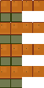

<!-- can merge this into README later as desired -->
## Connected Textures

Feature to create modular objects and furniture that change appearance based on connections.

### Supported

You can use this with:
- Most placable objects and big craftables, as long as they obey ParentSheetIndex
- Most furniture without rotations

You cannot use this with:
- Furniture with rotations
- Beds
- Fish Tanks
- Free Cactuses (randomized_plant)
- Bigger Craftables
- Furniture via Furniture Framework

### Data Format

To define connections, edit `sophie.Calcifer/ConnectedTextures` and add data like this:

```json
{
    "Action": "EditData",
    // Custom asset defining texture connections
    "Target": "sophie.Calcifer/ConnectedTextures",
    "Entries": {
        // Qualified item id
        "(F){{ModId}}_simple": {
            "Style": "Simple", // one of "Horizontal", "Vertical", "Simple", "Full". More on this in following sections
            "ConnectWith": [
                // Everything connects with itself
                "(F){{ModId}}_simple",
                // List of other items this item can connect into, they don't need to have `sophie.Calcifer/ConnectedTextures` entries (but it usually makes more sense if they did)
                "(F){{ModId}}_simple2",
                "(BC)12"
            ]
        },
    }
}
```

The number of sprites required depends on the connection Style, covered in sections below.

Besides having enough sprites, there is no fixed format. As long as the general rules about sprite index (left to right, then move to next row) is followed, you may put multiple sets of sprites on the same texture if desired. For your own convenience it's recommended to avoid having sets of sprites with different sizes on the same sheet.

#### `"Horizontal"`

_Sprite Count: 4_

Connect horizontally, repeating the middle section, and capping off at left and right ends.


#### `"Vertical"`

_Sprite Count: 4_

Connect vertically, repeating the middle section, and capping off at top and and bottom ends.


#### `"Simple"`

_Sprite Count: 16_

Connect in the four cardinal directions (up down left right).



#### `"Full"`

_Sprite Count: 47_

Connect in the four cardinal directions (up down left right) and the four ordinal directions (up/left, up/right, bottom/left, bottom/right).


For a larger object (i.e. furniture), we check these

### Determining Connections

Whenever you place an object with a `sophie.Calcifer/ConnectedTextures` definition, the neighbouring tiles are checked for connections.

There are 2 kinds of connections, sides (S) and corners (C). `"Full"` is the only mode that checks corners, the others check only the sides (up down left right).

For objects/big craftables, the 8 tiles around object (O) are checked like so:
```
CSC
SOS
CSC
```

Furniture can be larger (e.g. a 3x2 rug) so sides expand according to the object, but there are still only 4 corners.
```
CSSSC
SOOOS
SOOOS
CSSSC
```

A neighbour furniture is only considered connected if:
1. It has the same width and height as this furniture
2. It is aligned gridwise with this furniture

The furniture marked by A and B are considered connected here:
```
AAABBB
AAABBB
```

The furniture marked by A and B are **NOT** connected here:
```
AAA---
AAABBB
---BBB
```

### Lamp and Windows

Like in vanilla, you need to have a second texture offset to the right for the raining state (window) or the lit state (lamp). Each additional connection sprites also need to follow this format.


### Examples

There is an [example pack](./examples/ConnectedTexturesExamples) featuring all of these styles.
