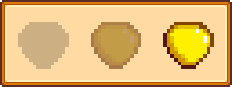

# Custom Achievements Redux
*by sophie*

[NexusMods](https://www.nexusmods.com/stardewvalley/mods/31429)  
[GitHub](https://github.com/sophiesalacia/StardewMods/tree/main/CustomAchievementsRedux)

## Creating Achievements

Achievements are contained in packs, which are created by modifying the asset `sophie.CustomAchievementsRedux/Achievements` using Content Patcher. The asset consists of a string → model lookup, where the key is the pack ID and the value is a model with these fields:

| Field | Description |
| --- | --- |
| DisplayName | The name that will show up in the achievement collections menu. Should be i18n'ed for easy translation support. Defaults to the pack ID if not provided. |
| Achievements | The achievements in the pack. This consists of a list of Achievement models (described below). |

The Achievement model has the following fields:
| Field | Required | Description |
| --- | :---: | --- |
| Id | ✔ | The internal ID for the achievement. This is used whenever referring to the achievement - for example, giving it to the player or querying if they have it. |
| DisplayName | | The name to display when hovering over the achievement. Should be i18n'ed for easy translation support. Defaults to the achievement ID if not provided. |
| RevealCondition | | A game state query that determines whether the achievement should be revealed or not. When the condition is not met, the achievement will show in the locked state (name displays as "???"). Defaults to true (achievement is revealed from the start). |
| LockedDescription | | Optional description text that displays when hovering over the achievement while it is locked. |
| UnobtainedDescription | | Optional description that displays when hovering over the achievement while it is unlocked, but has not been obtained. |
| ObtainedDescription | | Optional description that displays when hovering over the achievement once it has been obtained. |
| Texture | | The asset name for the texture sheet to use for the base and/or overlay. If not provided, will draw the vanilla star with no overlay. |
| BaseSpriteIndex | | The index to use for the sprite base (see examples below). If not provided, will draw the vanilla star as the base. |
| OverlaySpriteIndex | | The index to use for the sprite overlay (see examples below). If not provided, will not draw an overlay. |


## Examples

Here is a very basic example of an achievement pack with one achievement in it:
```json
{
    "Action": "EditData",
    "Target": "sophie.CustomAchievementsRedux/Achievements",
    "Entries": {
        "ExampleAchievementsPack": {
            "DisplayName": "Example Achievements Pack",
            "Achievements": [
                {
                    "Id": "PublicTransitFan",
                    "DisplayName": "Public Transit Fan",
                    "RevealCondition": "PLAYER_VISITED_LOCATION Current BusStop",
                    "LockedDescription": "Surely this town has some sort of public transportation...",
                    "UnobtainedDescription": "Maybe that old bus can be fixed up...",                                
                    "ObtainedDescription": "Fix up the bus.",
                    "Texture": "Mods\\sophie.ExamplePack\\Icons",
                    "BaseSpriteIndex": 0,
                    "OverlaySpriteIndex": 1
                }
            ]
        }
    }
},
```

Some examples of various combinations of base sprites and overlay sprites are below. From left to right the states are Locked, Unobtained and Obtained.

### No Base or Overlay Provided:


### Base Provided, No Overlay Provided:


### No Base Provided, Overlay Provided:


### Base and Overlay Provided:


## IDs

Everywhere this documentation refers to "full ID", it means the pack ID followed by the achievement ID, separated by a slash. It's important to use this when called for because multiple packs can have achievements with the same ID, and this is a consistent way to differentiate them since pack IDs cannot be the same.

In the example above, the full ID of the "Public Transit Fan" achievement would be `ExampleAchievementsPack/PublicTransitFan`.


## Giving Achievements

Achievements are given through the [action](https://stardewvalleywiki.com/Modding:Trigger_actions) `sophie.CustomAchievementsRedux/GiveAchievement`. This is because, especially when combined with [game state queries](https://stardewvalleywiki.com/Modding:Game_state_queries), actions are incredibly flexible and powerful. They can be used to give achievements through:
- reading mail
- completing special orders
- viewing events
- seeing NPC dialogue

in addition to everything that trigger actions themselves are capable of. When combined with a mod that expands on the available triggers, such as [BETAS](https://www.nexusmods.com/stardewvalley/mods/27100), the possibilities are enormous.

The syntax is `sophie.CustomAchievementsRedux/GiveAchievement <achievement full ID>`.


## Queries

CAR provides a [game state query](https://stardewvalleywiki.com/Modding:Game_state_queries), `sophie.CustomAchievementsRedux_PlayerHasAchievement <player> <achievement full ID>`.


## Content Patcher Token

In addition to the game state query, CAR provides a Content Patcher token, `sophie.CustomAchievementsRedux/PlayerHasAchievement`. It works similarly to the query, except that the player argument is optional and must be provided via named argument. For example:
`{{sophie.CustomAchievementsRedux/PlayerHasAchievement:MyAchievementId}}` will return whether the local player has the achievement.
`{{sophie.CustomAchievementsRedux/PlayerHasAchievement:MyAchievementId |player=Host}}` will return whether the *host* has the achievement.


## Console Commands

These are mostly useful for if you're testing your achievement packs and you don't want to have to start a new save or reload the day every time you tweak the conditions. **Please note** that if you are using trigger actions to apply achievements, you will need to mark them as unapplied as well, because by default they will only fire once. You can do this, for example, with console commands: `debug action MarkActionApplied Current <trigger action id> false`

### sophie.car.set

Sets whether or not the player has the specified achievement, regardless of whether conditions are met. Argument 0 is the full ID and argument 1 is whether the player should have it or not (true/false, defaults to true)

Examples:

`sophie.car.set ExamplePackId/ExampleAchievementId` gives the player the achievement with ID ExampleAchievementId in the pack with ID ExamplePackId if successfully found.
`sophie.car.set ExamplePackId/ExampleAchievementId false` removes the matching achievement ExamplePackId/ExampleAchievementId from the player.

### sophie.car.clear

Clears all achievements which are from the pack with the provided ID.

Examples:

`sophie.car.clear ExamplePackId` would remove any achievements the player has obtained from the pack with ID ExamplePackId.


## Compatibility

This was written for Stardew Valley version 1.6.15 and most likely will not work with previous versions. I have no plans to backport it.

There shouldn't be too many mod compatibility issues, as not many mods alter the achievements portion of the collections menu. However, I wouldn't recommend running this alongside erinth's original Custom Achievements mod, as there may be unexpected behavior.

Multiplayer has not been tested and while it should be relatively bug-free, unexpected behavior may occur. This mod is entirely client-side, so queries that check for other players' achievements may fail if those players do not also have CAR installed. Therefore, I would recommend anyone playing multiplayer to ensure that all players joining the server have CAR and any achievement packs installed that the host does.
